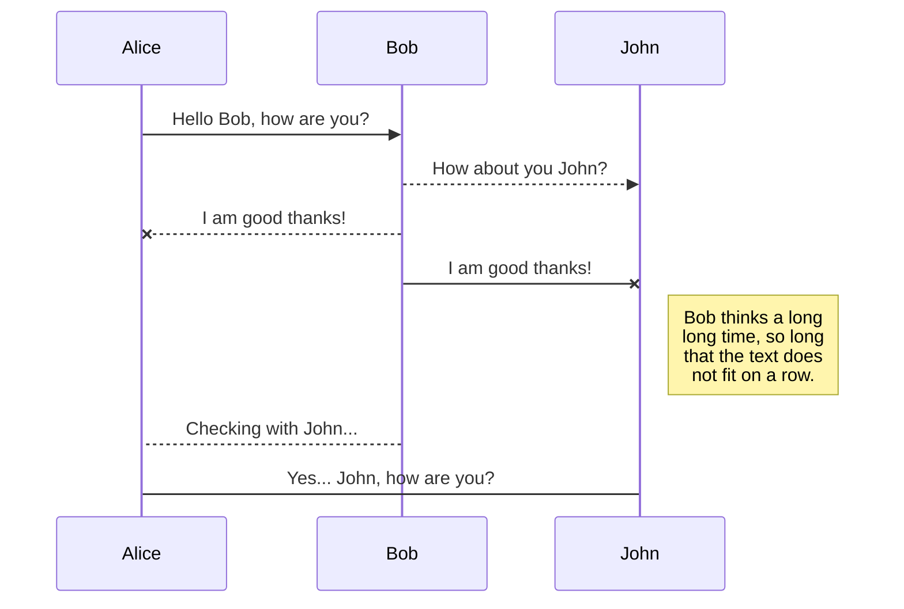
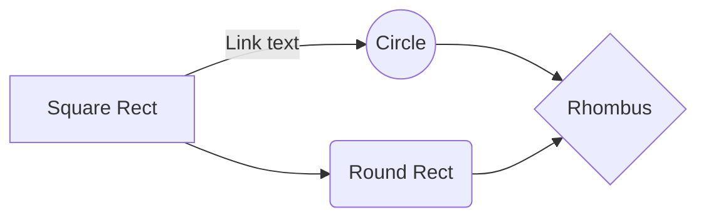

# HomePage!

# About us

SalesDepartment came into life with a moto to solve the problems by introducing new and proven stratgies to shorten the sales cycle and increase profit/revenue. 
During our careers we saw some companies facing problems and there were very less focused solutions to that and we can with an idea if we can solve it and help individuals and companies.

Companies treat us as their sales department, by helping them to increase their current sales, and also helping their current sales team as an extension to generate more revenue. 

# Services(Page)
## Dedicated Trade Forces
    You don't need a dedicated team, but want sales support? This solution is just for you.  
## Shared Trade Forces
   You don't need a dedicated team, but want sales support? This solution is just for you.
## Sales management
Already have a sales department? However, the effects are not satisfactory? Let us check that all the settings are correct.
## Remote Trade Forces
Are you conquering a local market that is shrinking fast? Time to go out into the open. We will conquer Europe, Russia, Ukraine, India and the Persian Gulf countries for you.
## VPS Hosting
Are you looking for investors ready to cooperate? Let us get to know you.
## Body leasing
  Are you looking for people for your teams? We will find people for your IT teams.

# References

Cypherdog.

# Partners

You can rename the current file by clicking the file name in the navigation bar or by clicking the **Rename** button in the file explorer.

# Contact

You can delete the current file by clicking the **Remove** button in the file explorer. The

## SmartyPants

SmartyPants converts ASCII punctuation characters into "smart" typographic punctuation HTML entities. For example:

|                |ASCII                          |HTML                         |
|----------------|-------------------------------|-----------------------------|
|Single backticks|`'Isn't this fun?'`            |'Isn't this fun?'            |
|Quotes          |`"Isn't this fun?"`            |"Isn't this fun?"            |
|Dashes          |`-- is en-dash, --- is em-dash`|-- is en-dash, --- is em-dash|

## KaTeX

You can render LaTeX mathematical expressions using [KaTeX](https://khan.github.io/KaTeX/):

The *Gamma function* satisfying $\Gamma(n) = (n-1)!\quad\forall n\in\mathbb N$ is via the Euler integral

$$
\Gamma(z) = \int_0^\infty t^{z-1}e^{-t}dt\,.
$$

> You can find more information about **LaTeX** mathematical expressions [here](http://meta.math.stackexchange.com/questions/5020/mathjax-basic-tutorial-and-quick-reference).

## UML diagrams

You can render UML diagrams using [Mermaid](https://mermaidjs.github.io/). For example, this will produce a sequence diagram:

And this will produce a flow chart:

<!--stackedit_data:
eyJoaXN0b3J5IjpbLTIxMDM5Mjg3NzYsNDk4ODAzNTQ1LDE2ND
kwNTcyMDMsLTE4Mzc5ODQ1NzIsLTIwNjEzNTk4NTAsMTA1Njk0
OTM5NCwyMTA2ODg0NDI5LDMyNjkwNDczM119
-->